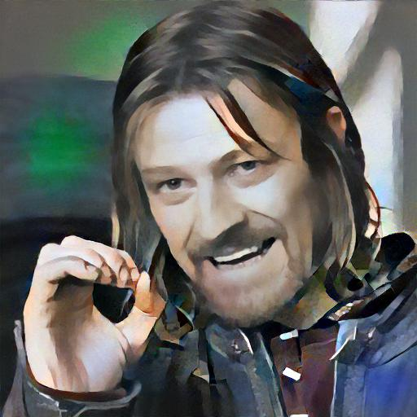
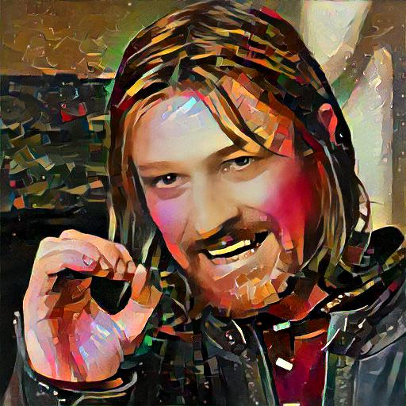

# Udnie stylish
Applies artistic style transfer to images using:
- pre-trained VGG-19 model for features extraction,
- and optimization-based NST algorithm (L-BFGS or Adam)

### Usage
You need Python 3.9 or later, then requirements:
```sh
pip install -r requirements.txt
```

To run:
```sh
python src/nst.py --input=<path> [--style=<style>]
```

more options:
```sh
python src/nst.py --help

  --input INPUT         Path to the input image
  --style {udnie,sunflowers,starry_night,X,17a}
                        Style reference, By default: udnie
  --device {cpu,cuda,mps,tpu}
                        Device type to run the model on, By default: the best available
  --init {input,random,blend}
                        Method to create initial image for style transfer, By default: clone input
  --optim {lbfgs,adam}  Optimization algorithm, By default: lbfgs
  --steps STEPS         Number of optimization steps, By default: 150
  --size SIZE           Size of the images in the optimization, By default: 512
  --show                Show the styled image
```

### Examples
Input image:  


Style images:  


Output images:  




### TPU
If you want to run on TPU device (e.g. Google Colab), then also install PyTorch XLA:
```sh
pip install torch_xla[tpu] -f https://storage.googleapis.com/libtpu-releases/index.html
````

Does not support L-BFGS optimization, only Adam.
